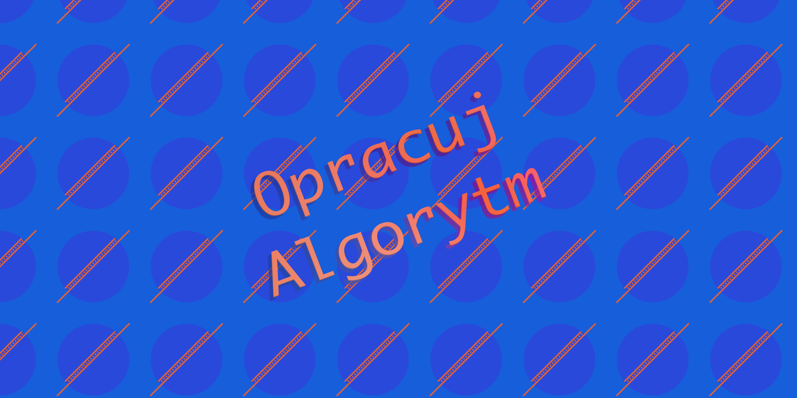

# Opracuj Algorytm

To repozytorium służy do nauki języka C++ (w przyszłości możliwe, że HTML). Zawiera ono objaśnienia, analizy kodu, ćwiczenia oraz skrypty i opisy ułatwiające naukę.  
**[LINK DO REPOZYTORIUM](https://github.com/Cimlah/opracuj-algorytm)**

# Aktualności
## Rozpoczęcie pracy nad nowym projektem [`002`](https://github.com/Cimlah/opracuj-algorytm/tree/c%2B%2B/002%20-%20losowanie%20liczb%20i%20operacje%20na%20tablicach)

# Spis branchów

1. [c++](https://github.com/Cimlah/opracuj-algorytm/tree/c++) - projekty/tutoriale o C++

# Zasady współtworzenia
- Wszelka treść z wyjątkiem bezpośredniego kodu, nazw plików czy katalogów powinna być tworzona w języku polskim. Dozwolone są zrozumiałe informatyczne anglojęzyczne wyrażenia i zwroty.

- Każdy z projektów/tutoriali powinien się znajdować w osobnym katalogu w odpowiednim dla języka branchu. Nazwy katalogów powinny być skrótowe, ale w miarę zrozumiałe.

- W każdym projekcie powinny się znajdować odpowiednie dla systemu operacyjnego osobne katalogi ze skryptami czy innymi plikami wykonawczymi.

- Jeżeli w danym branchu znajdują się dodatkowe zasady współtworzenia, powinno się do nich dostosować.